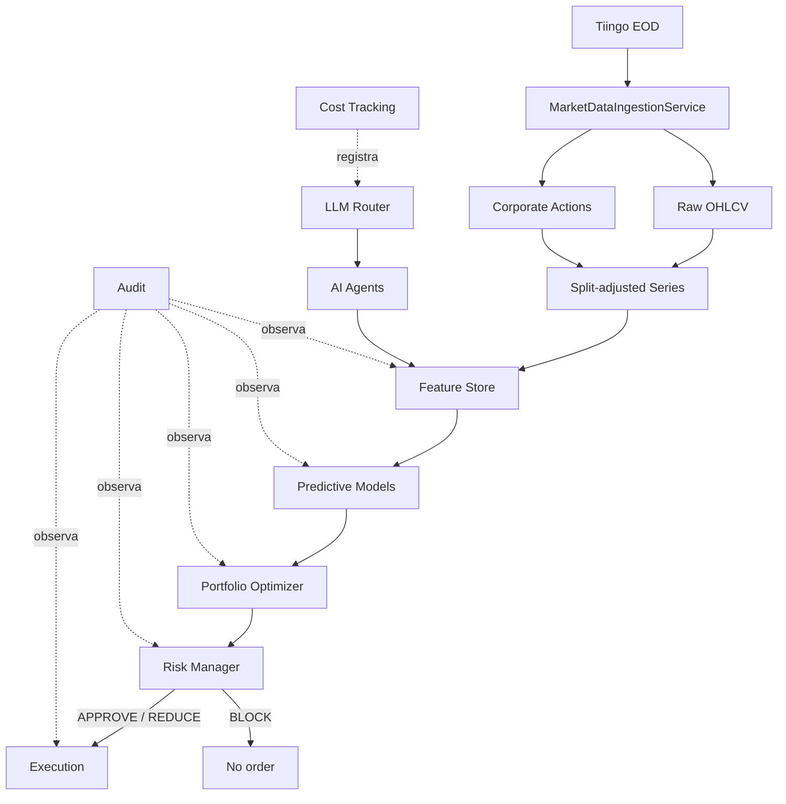

# Arquitectura

## Flujo principal

La información se obtiene y transforma antes de predecir. Una predicción no es una orden: el optimizador propone, el Risk Manager decide y solo una propuesta aprobada o reducida puede llegar a ejecución.

## Responsabilidad por paquete

| Paquete | Responsabilidad | Estado |
|---|---|---|
| `core` | Configuración, tiempo, excepciones, enums y logging | Funcional |
| `data.schemas` | Contratos point-in-time y FeatureRow | Funcional |
| `data.sources` | Contrato de fuentes y adapter Tiingo EOD | Funcional para Tiingo |
| `data.ingestion` | Orquestación incremental, validación y normalización | Funcional Phase 1A |
| `data.calendar` | Sesiones, aperturas y cierres XNYS | Funcional |
| `data.normalization` | Corporate actions y ajuste explícito por splits | Funcional |
| `data.storage` | Persistencia idempotente Parquet y consulta DuckDB | Funcional básico |
| `data.validation` | Invariantes temporales y feature/target | Funcional |
| `features` | Transformaciones cuantitativas causales y targets separados | Funcional básico |
| `agents` | Contexto/respuesta común y agentes especializados | Contratos/stubs |
| `llm` | Router, clientes, pricing, costos y cache | Infraestructura local; clientes stub |
| `models` | Contratos de regresión, clasificación y ranking | Stub |
| `portfolio` | Estado, forecasts, propuestas y optimizador | Contrato |
| `risk` | Límites y decisión independiente | Funcional básico |
| `backtesting` | Contrato de motor y métricas | Parcial |
| `execution` | Órdenes, fills y paper executor | Contrato/stub |
| `audit` | Registro reconstruible de decisiones | Funcional básico |

## Dependencias permitidas

- `core` no depende de capas de negocio.
- `data` puede depender de `core`; no depende de agentes, modelos, cartera ni ejecución.
- `features` depende de schemas/datos y librerías numéricas; no depende de modelos o ejecución.
- `agents` depende de sus contratos, datos disponibles y la abstracción LLM; no de portfolio, risk o execution.
- `llm` es infraestructura transversal y no decide inversiones.
- `models` consume features, no documentos crudos ni outputs de ejecución.
- `portfolio` consume forecasts y estado, no llama agentes o proveedores.
- `risk` puede validar propuestas de portfolio y estado/medidas de riesgo; no depende de LLM.
- `execution` consume únicamente órdenes derivadas de una decisión de riesgo autorizada.
- `audit` puede registrar resultados de todas las etapas, pero ninguna etapa debe depender de audit para su lógica financiera.

Dependencias prohibidas: `agents → execution`, `llm → execution`, `models → data.sources`, `execution → agents`, y cualquier ruta que evite `risk`. Los targets tampoco pueden fluir hacia agentes, inferencia o optimización.

## Almacenamiento

Parquet es el formato durable inicial para raw, processed y features. DuckDB consulta estos archivos localmente sin introducir un servicio de base de datos. El cache de análisis usa archivos JSON identificados por `source_id`, hash de contenido y versión de análisis. La auditoría inicial usa JSON Lines. Esta elección es adecuada para una fase local y testeable; escalar infraestructura requiere una necesidad demostrada y un ADR.

`MarketDataIngestionService` consulta el último dato local, aplica overlap, obtiene barras desde el adapter, valida, extrae acciones, hace upsert y reconstruye la serie split-adjusted. La estructura física es `raw/tiingo/daily`, `raw/tiingo/corporate_actions` y `processed/market/split_adjusted`. Los archivos permiten reconstruir provider, ingestión, schema, normalización, ticker y rango.

La capa processed no usa los campos `adj*` del proveedor como fuente de verdad. Los conserva en raw para comparación, pero deriva su propia serie reproducible solo con splits. Véase ADR-007.

## Point-in-time y Feature Store

Los schemas preservan cuatro timestamps con semánticas distintas. `available_at <= decision_time` se valida antes de usar registros. El Feature Store tiene granularidad `ticker + decision_date`; los joins deben respetar disponibilidad y nunca usar la última revisión conocida hoy para simular una decisión pasada.

Features y targets comparten un schema de persistencia por conveniencia, pero tienen registros de columnas disjuntos. `model_features()` expone solo inputs. `FeatureBuilder.add_targets()` es una operación explícita y separada, apropiada para preparación de datasets supervisados, no para inferencia.

## LLM Router, costos y cache

Los agentes envían `LLMRequest` al router, que selecciona cliente y modelo desde configuración. Esto centraliza proveedores, políticas, observabilidad y futuros límites de presupuesto. Cada respuesta debe producir un `LLMCallRecord`, cuyo costo se calcula mediante `PricingRegistry`. El cache permite reutilizar análisis únicamente cuando coinciden contenido y versión.

Los clientes actuales lanzan `ExternalCallDisabled`: no existen llamadas reales ni secrets incorporados.

## Auditoría

`DecisionAuditRecord` captura el contexto suficiente para responder por qué se produjo una acción: features, modelo, predicción, propuesta, riesgo, resultado, agentes, fuentes y costo. La auditoría registra decisiones; no las altera.

## Por qué los agentes no ejecutan

Un agente LLM procesa texto potencialmente incompleto, conflictivo o malicioso y su salida es probabilística. Darle acceso directo a ejecución mezclaría evidencia con autoridad, impediría imponer límites deterministas y haría difícil reconstruir responsabilidades. Separar agentes, optimizador, Risk Manager y execution garantiza que:

- una opinión narrativa no se convierta automáticamente en una orden;
- exposición y límites se apliquen de manera determinista;
- el Risk Manager pueda reducir o bloquear cualquier propuesta;
- errores, prompt injection o fallos de proveedor no tengan acceso al broker;
- auditoría y backtesting reproduzcan cada transformación.

Esta frontera no debe romperse ni siquiera en la fase de ejecución automática.
