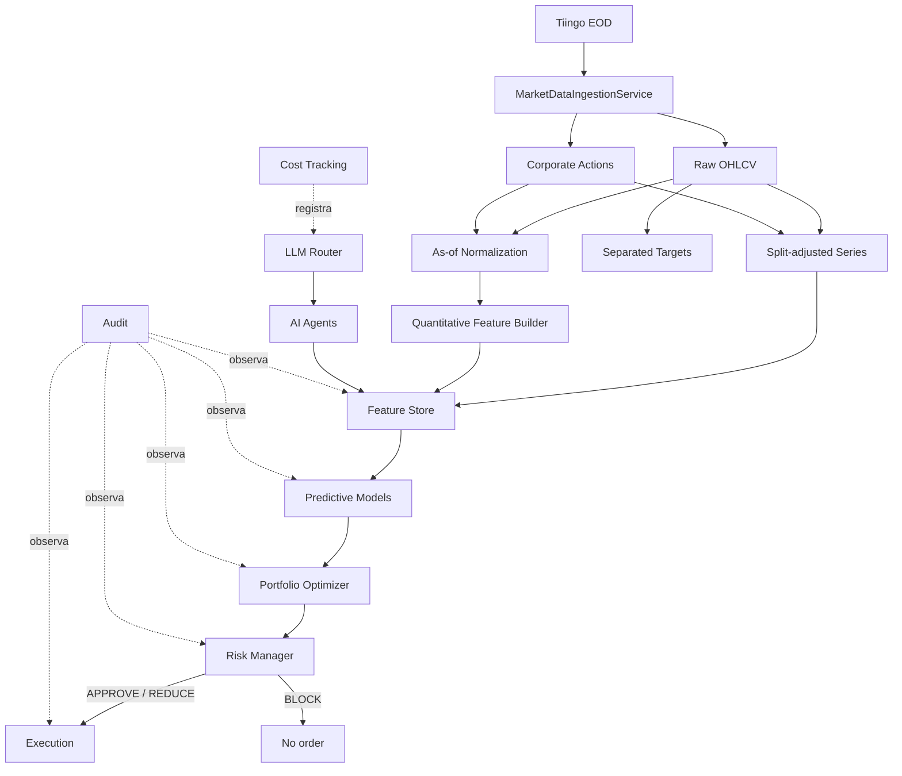

# Arquitectura

## Flujo principal

La información se obtiene y transforma antes de predecir. Una predicción no es una orden: el optimizador propone, el Risk Manager decide y solo una propuesta aprobada o reducida puede llegar a ejecución.

## Responsabilidad por paquete

| Paquete | Responsabilidad | Estado |
|---|---|---|
| `core` | Configuración, tiempo, excepciones, enums y logging | Funcional |
| `data.schemas` | Contratos point-in-time y FeatureRow | Funcional |
| `data.sources` | Contrato de fuentes y adapter Tiingo EOD | Funcional para Tiingo |
| `data.ingestion` | Orquestación incremental, validación y normalización | Funcional Phase 1A |
| `data.calendar` | Sesiones, aperturas y cierres XNYS | Funcional |
| `data.normalization` | Corporate actions y ajuste explícito por splits | Funcional |
| `data.corporate_actions` | Detección y exclusión auditable de eventos complejos | Funcional Phase 1D.1 |
| `data.storage` | Persistencia idempotente Parquet y consulta DuckDB | Funcional básico |
| `data.validation` | Invariantes temporales y feature/target | Funcional |
| `data.pilot` | Orquestación y diagnóstico no destructivo del piloto real | Funcional Phase 1C |
| `features` | Transformaciones cuantitativas, builder as-of y targets separados | Funcional Phase 1B |
| `agents` | Contexto/respuesta común y agentes especializados | Contratos/stubs |
| `llm` | Router, clientes, pricing, costos y cache | Infraestructura local; clientes stub |
| `models` | Contratos de regresión, clasificación y ranking | Stub |
| `portfolio` | Estado, forecasts, propuestas y optimizador | Contrato |
| `risk` | Límites y decisión independiente | Funcional básico |
| `backtesting` | Contrato de motor, schemas, accounting histórico y métricas | Funcional Phase 2A.1; loop pendiente |
| `execution` | Órdenes, fills y paper executor | Contrato/stub |
| `audit` | Registro reconstruible de decisiones | Funcional básico |

## Dependencias permitidas

- `core` no depende de capas de negocio.
- `data` puede depender de `core`; no depende de agentes, modelos, cartera ni ejecución.
- `features` depende de schemas/datos y librerías numéricas; no depende de modelos o ejecución.
- `agents` depende de sus contratos, datos disponibles y la abstracción LLM; no de portfolio, risk o execution.
- `llm` es infraestructura transversal y no decide inversiones.
- `models` consume features, no documentos crudos ni outputs de ejecución.
- `portfolio` consume forecasts y estado, no llama agentes o proveedores.
- `risk` puede validar propuestas de portfolio y estado/medidas de riesgo; no depende de LLM.
- `execution` consume únicamente órdenes derivadas de una decisión de riesgo autorizada.
- `audit` puede registrar resultados de todas las etapas, pero ninguna etapa debe depender de audit para su lógica financiera.

Dependencias prohibidas: `agents → execution`, `llm → execution`, `models → data.sources`, `execution → agents`, y cualquier ruta que evite `risk`. Los targets tampoco pueden fluir hacia agentes, inferencia o optimización.

Los aliases viven en `config/provider_symbols.yaml`: solo el adapter traduce la
request y toda salida conserva el ticker interno. Los eventos complejos viven en
una tabla processed separada. Sus flags de features están limitados por
`known_at`; los flags de targets pueden mirar dentro del horizonte futuro y no
retornan al flujo de inferencia.

## Almacenamiento

Parquet es el formato durable inicial para raw, processed y features. DuckDB consulta estos archivos localmente sin introducir un servicio de base de datos. El cache de análisis usa archivos JSON identificados por `source_id`, hash de contenido y versión de análisis. La auditoría inicial usa JSON Lines. Esta elección es adecuada para una fase local y testeable; escalar infraestructura requiere una necesidad demostrada y un ADR.

`MarketDataIngestionService` consulta el último dato local, aplica overlap, obtiene barras desde el adapter, valida, extrae acciones, hace upsert y reconstruye la serie latest-basis. La estructura física es `raw/tiingo/daily`, `raw/tiingo/corporate_actions` y `processed/market/split_adjusted_latest`. Los archivos permiten reconstruir provider, ingestión, schema, normalización, ticker y rango.

La capa processed no usa los campos `adj*` del proveedor como fuente de verdad. Los conserva en raw para comparación, pero deriva su propia serie reproducible solo con splits. Latest-basis sirve para exploración y auditoría; decisiones históricas deben construir una vista as-of que filtre barras y acciones por disponibilidad. Véanse ADR-007 y ADR-008.

## Point-in-time y Feature Store

Los schemas preservan cuatro timestamps con semánticas distintas. `available_at <= decision_time` se valida antes de usar registros. El Feature Store tiene granularidad `ticker + decision_date`; los joins deben respetar disponibilidad y nunca usar la última revisión conocida hoy para simular una decisión pasada.

Features y targets tienen registros y persistencia separados conforme a ADR-009. `model_features()` expone solo inputs. Labels se construyen en `features.targets` y solo se unen a features por `ticker + decision_date` durante entrenamiento futuro.

El builder agrupa fechas consecutivas cuyo conjunto de splits elegibles no cambia. También abre un nuevo segmento cuando una barra histórica retrasada del activo o SPY pasa a estar disponible. Para cada segmento construye una sola vista as-of hasta su fecha final, calcula rolling features vectorizadas y conserva únicamente sus filas. Barras futuras con fecha posterior son causalmente inocuas; una barra retrasada con fecha histórica no lo es y por eso constituye un límite.

Los límites de segmentos y `history_count` se derivan de eventos de disponibilidad y búsquedas sobre cutoffs precomputados; no se vuelve a escanear todo el histórico por cada fecha de decisión. Los factores de splits futuros se calculan mediante productos acumulados por ticker y fecha efectiva. Estas optimizaciones preservan las reglas causales y tienen regresiones contra implementaciones ingenuas.

Features se almacenan por año en un archivo Parquet consolidado. Un rebuild reemplaza autoritativamente todos los registros de los tickers y rango solicitados antes de insertar el resultado, eliminando filas obsoletas sin afectar otros rangos o activos. Targets usan la misma política en otra raíz. DuckDB puede consultar `year=*/data.parquet` con hive partitioning. Un cambio histórico de corporate actions, disponibilidad, cutoff, calendario, fórmula o versión exige reconstruir el período afectado; cambios de splits pueden justificar full rebuild del ticker.

Phase 1C añade una capa de pilotaje, no una nueva metodología financiera. `RealDataPilot` reutiliza ingesta, stores y builder existentes; mide cobertura y rendimiento, reconstruye ventanas as-of alrededor de splits y bloquea el resultado si falla una comprobación temporal. Su JSON de reporte es evidencia diagnóstica, no una entrada de features ni de entrenamiento.

Phase 1D amplía esa orquestación al universo fijo configurado. Los errores recuperables se aíslan por ticker, la ingesta puede reanudarse omitiendo coberturas locales completas y el ranking se calcula conjuntamente solo sobre activos invertibles; SPY continúa siendo benchmark de entrada y no participa en el ranking.

## Backtesting y accounting histórico

`backtesting.schemas` define contratos históricos separados de los contratos
conceptuales basados en pesos de `portfolio` y de la ejecución futura. Una
`TargetAllocation` sigue siendo una intención de pesos, mientras
`SimulatedOrder` y `SimulatedFill` representan unidades. Esta separación no
autoriza una ruta que omita al Risk Manager cuando se implemente el loop.

`PortfolioLedger` mantiene cash y posiciones long-only de forma determinista.
Los fills usan precios raw; `fill_price` ya incorpora slippage y las comisiones
se cargan directamente a cash. Splits cambian quantity y average cost usando la
convención acciones nuevas/antiguas, y dividendos acreditan cash explícitamente.
Los snapshots expresan gross/net exposure como fracción de NAV. Phase 2A.1 no
incluye calendario, estrategia, generación de órdenes ni ejecución temporal.

## LLM Router, costos y cache

Los agentes envían `LLMRequest` al router, que selecciona cliente y modelo desde configuración. Esto centraliza proveedores, políticas, observabilidad y futuros límites de presupuesto. Cada respuesta debe producir un `LLMCallRecord`, cuyo costo se calcula mediante `PricingRegistry`. El cache permite reutilizar análisis únicamente cuando coinciden contenido y versión.

Los clientes actuales lanzan `ExternalCallDisabled`: no existen llamadas reales ni secrets incorporados.

## Auditoría

`DecisionAuditRecord` captura el contexto suficiente para responder por qué se produjo una acción: features, modelo, predicción, propuesta, riesgo, resultado, agentes, fuentes y costo. La auditoría registra decisiones; no las altera.

## Por qué los agentes no ejecutan

Un agente LLM procesa texto potencialmente incompleto, conflictivo o malicioso y su salida es probabilística. Darle acceso directo a ejecución mezclaría evidencia con autoridad, impediría imponer límites deterministas y haría difícil reconstruir responsabilidades. Separar agentes, optimizador, Risk Manager y execution garantiza que:

- una opinión narrativa no se convierta automáticamente en una orden;
- exposición y límites se apliquen de manera determinista;
- el Risk Manager pueda reducir o bloquear cualquier propuesta;
- errores, prompt injection o fallos de proveedor no tengan acceso al broker;
- auditoría y backtesting reproduzcan cada transformación.

Esta frontera no debe romperse ni siquiera en la fase de ejecución automática.
